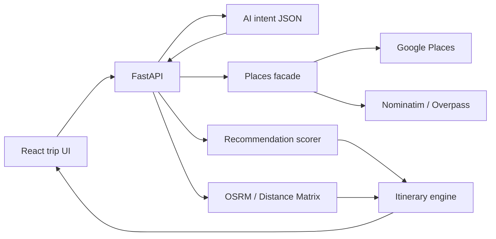

# AI Travel Guide

A premium, portfolio-grade travel companion that turns a natural-language request into a route-aware itinerary. It is not a chatbot wrapper. Intelligence lives in the pipeline: structured intent, live place data, deterministic scoring, travel-time planning, and a cinematic UI.

## Overview

**AI Travel Guide** helps someone describe a trip in plain language — destination, dates, budget, interests, travel style — and receive a practical day-by-day plan with distances, visit durations, explanations, a map, and an estimated budget range.

## Problem Statement

Planning a trip usually means bouncing between maps, blogs, review sites, and spreadsheets. Distances, opening hours, taste, and time never live in one place. Generic AI itineraries ignore geography and invent unrealistic days.

## Solution

The product combines:

- **Llama 3.3 70B** (via OpenRouter, Groq preferred) for intent extraction, copy, and itinerary edits
- **Google Places** when a Maps API key is present, otherwise **OpenStreetMap / Nominatim / Overpass**
- **OSRM** driving times with haversine fallback
- A **deterministic recommendation engine** (interest match, rating, distance, budget, itinerary fit)
- A **route-aware scheduler** that clusters nearby places and respects travel style

## Features

- Cinematic landing page and mood-based discovery
- Natural language + guided trip planner
- Structured AI intent extraction (validated JSON, never raw model output)
- Place discovery, scoring, and explainable recommendations
- Day-by-day itinerary with travel time between stops
- Interactive dark map with day switching
- Contextual trip assistant (replace a stop, less driving, more food, regenerate a day)
- Estimated budget ranges (clearly labeled as estimates)
- Save trips in `localStorage`, structured for future auth and cloud sync
- Polished loading, empty, and error states
- Responsive itinerary-first mobile layout

## AI Architecture

```text
USER INPUT
      ↓
AI INTENT ANALYSIS (Llama 3.3 70B, JSON validated by Pydantic)
      ↓
STRUCTURED PREFERENCES
      ↓
PLACE DISCOVERY (Google Places or OSM / Overpass + curated fallback)
      ↓
DETERMINISTIC SCORING
      ↓
ROUTE / DISTANCE ANALYSIS (OSRM or Google Distance Matrix)
      ↓
ITINERARY CONSTRUCTION (cluster → nearest neighbor → 2-opt → meals)
      ↓
AI NARRATIVE + EXPLANATIONS
      ↓
FRONTEND TRIP EXPERIENCE
```

The assistant does **not** rewrite the whole trip as free text. It returns structured actions (`remove`, `replace`, `less_driving`, `adjust_style`, …) that the itinerary engine applies.

## Recommendation Engine

```text
Travel Recommendation Score =
  Interest Match
+ Rating Score
+ Distance Efficiency
+ Budget Compatibility
+ Itinerary Fit
+ Popularity / quality signals
```

A photography + mountains traveler ranks scenic viewpoints above generic shopping malls even if the model never “picks” places by itself.

## Itinerary Generation Logic

1. Filter attractions vs meals vs hotels
2. Cluster high-scoring places geographically across N days
3. Order each day with nearest-neighbor + 2-opt from the previous location
4. Insert lunch and dinner near the current point
5. Respect travel style: relaxed days have fewer stops and later starts
6. Attach a short “why this stop” explanation using score reasons and travel time

## Technology Stack

| Layer | Stack |
| --- | --- |
| Frontend | React 19, Vite, TypeScript, React Router, Leaflet, Framer Motion-ready CSS |
| Backend | FastAPI, Pydantic v2, httpx, SlowAPI |
| AI | OpenRouter → `meta-llama/llama-3.3-70b-instruct`, provider order Groq |
| Maps | Leaflet + CARTO dark tiles; OSRM; optional Google Maps Platform |

## Google Maps Integration

If `GOOGLE_MAPS_API_KEY` is set, the backend uses Google Geocoding, Places Nearby Search, and Distance Matrix. The key stays on the server.

Without a Google key, the app still plans real trips using Nominatim, Overpass, OSRM, and curated high-quality seeds for destinations such as Islamabad, Abbottabad, Hunza, Murree, and Lahore.

## Project Architecture



```text
index.html          Vite app entry (repository root)
src/                React pages and components
backend/            FastAPI, AI, places, itinerary engine
.github/workflows   GitHub Pages build
```

## Installation

```bash
# from the project root
python -m venv .venv
# Windows
.venv\Scripts\activate
pip install -r backend/requirements.txt
npm install
```

## Environment Variables

Copy `.env.example` to `.env` (this repo already expects `.env` at the project root).

| Variable | Required | Purpose |
| --- | --- | --- |
| `OPENROUTER_API_KEY` | Yes | LLM access |
| `OPENROUTER_MODEL` | No | Default `meta-llama/llama-3.3-70b-instruct` |
| `OPENROUTER_PROVIDER` | No | Default `Groq` |
| `GOOGLE_MAPS_API_KEY` | No | Places / geocode / distance |
| `CORS_ORIGINS` | No | Comma-separated browser origins |

Never put AI or unrestricted Google keys in frontend code.

## Running Locally

On Windows you can double-click `start.bat`, or use two terminals:

Terminal 1 — API:

```bash
python run.py
```

API: [http://127.0.0.1:8010](http://127.0.0.1:8010) · health: `/api/health`

Terminal 2 — UI:

```bash
npm run dev
```

App: [http://localhost:5173](http://localhost:5173)

Vite proxies `/api` to FastAPI. After `npm run build`, FastAPI also serves the compiled app from `/`.

The repository root `index.html` is the app entry. GitHub Pages deploys the production build automatically from `main`. Full AI planning still needs the FastAPI backend running with your `.env` key.

## Future Improvements

- Weather-aware day shuffling
- Collaborative trips and accounts
- Preference memory across journeys
- Offline itinerary package
- Packing assistant
- Destination safety summaries from official sources
- Deeper restaurant and hotel clustering
- PDF / shareable link export
- Calendar export (ICS)

## License

Private portfolio project. Photography via Unsplash. Map data © OpenStreetMap contributors.
